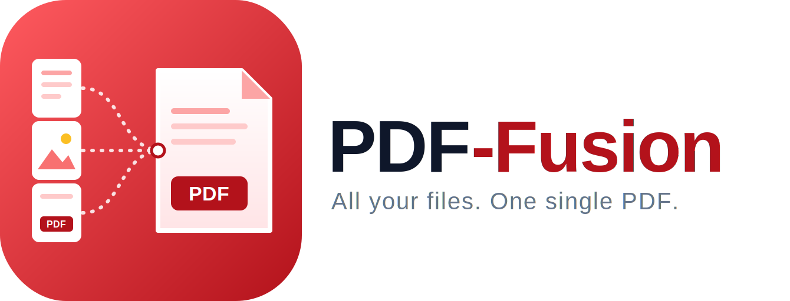

# PDF-Fusion

[](https://kotlinlang.org)
[](https://developer.android.com/)
[](https://github.com/Kaia-Alenia/pdf-fusion/blob/main/LICENSE)
[](https://github.com/Kaia-Alenia/pdf-fusion/releases/latest)

> Native, 100% Offline PDF and Image Merger for Android

PDF-Fusion is a fast and privacy-focused Android application designed to seamlessly merge multiple PDF documents and images into a single file. Unlike other tools, **PDF-Fusion operates entirely offline**, ensuring your sensitive documents never leave your device.

*Read this document in [Español](README_es.md).*

## Features

- **100% Offline**: No internet connection required. Complete privacy.
- **Image Support**: Automatically scales images to A4 format to ensure consistent page sizing.
- **Fast & Native**: Built with Kotlin and Android native tools for maximum performance.
- **Open Source**: GNU GPL v3 licensed. 

## Requirements

- Android 8.0 (API level 26) or higher.
- Storage permissions for selecting and saving files.

## Installation

You can build the app from source or download the latest APK from the [Releases](https://github.com/aleniastudios/pdf-fusion/releases/latest) page.

```bash
# Clone the repository
git clone https://github.com/aleniastudios/pdf-fusion.git

# Enter the directory
cd pdf-fusion

# Build and install the debug APK
./gradlew installDebug
```

## Contributing

We welcome contributions! Please follow our code standards:
- All source code, variables, functions, and non-trivial comments must be in **English** (to facilitate open-source contributions).
- Use English for commits and pull requests.
- Ensure your changes do not compromise the offline-only nature of the app.

## License

This project is licensed under the **GNU GPL v3**. See the [LICENSE](LICENSE) file for details.
Assets and designs are governed by Alenia Studios standard licenses (see our guidelines for asset usage).
