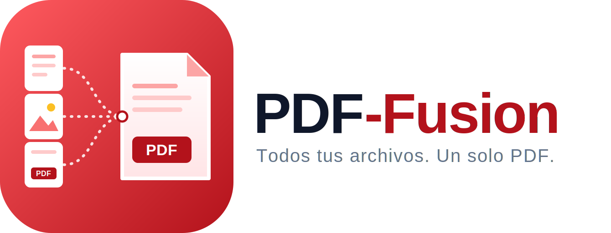

# PDF-Fusion

[](https://kotlinlang.org)
[](https://developer.android.com/)
[](https://github.com/aleniastudios/pdf-fusion/blob/main/LICENSE)
[](https://github.com/aleniastudios/pdf-fusion/releases/latest)

> Unificador de PDF e Imágenes Nativo y 100% Offline para Android

PDF-Fusion es una aplicación rápida y enfocada en la privacidad, diseñada para unir múltiples documentos PDF e imágenes en un solo archivo. A diferencia de otras herramientas, **PDF-Fusion funciona completamente offline**, garantizando que tus documentos sensibles nunca salgan de tu dispositivo.

*Read this document in [English](README.md).*

## Características

- **100% Offline**: No requiere conexión a internet. Privacidad total.
- **Soporte para Imágenes**: Escala automáticamente las imágenes al formato A4 para garantizar un tamaño de página consistente.
- **Rápido y Nativo**: Construido con Kotlin y herramientas nativas de Android para un rendimiento máximo.
- **Código Abierto**: Licencia GNU GPL v3.

## Requisitos

- Android 8.0 (API level 26) o superior.
- Permisos de almacenamiento para seleccionar y guardar archivos.

## Instalación

Puedes compilar la aplicación desde el código fuente o descargar la última APK desde la página de [Releases](https://github.com/aleniastudios/pdf-fusion/releases/latest).

```bash
# Clona el repositorio
git clone https://github.com/aleniastudios/pdf-fusion.git

# Entra al directorio
cd pdf-fusion

# Compila e instala el APK de depuración
./gradlew installDebug
```

## Contribución

¡Las contribuciones son bienvenidas! Por favor, sigue nuestros estándares de código limpio:
- Todo el código fuente, variables, funciones y comentarios no triviales deben estar en **Inglés** (para facilitar la contribución open-source).
- Usa Inglés para los commits y pull requests.
- Asegúrate de que tus cambios no comprometan la naturaleza offline de la aplicación.

## Licencia

Este proyecto está bajo la licencia **GNU GPL v3**. Consulta el archivo [LICENSE](LICENSE) para más detalles.
Los recursos visuales y el diseño se rigen por las licencias estándar de Alenia Studios (consulta nuestras directrices para el uso de assets).
